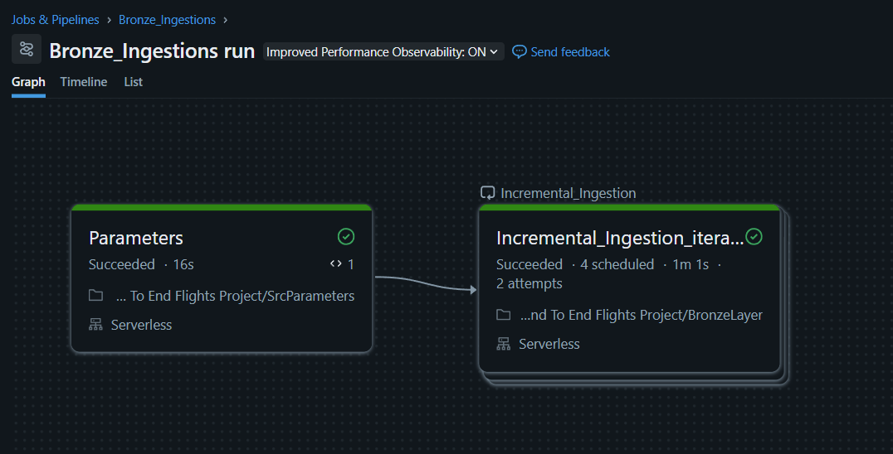
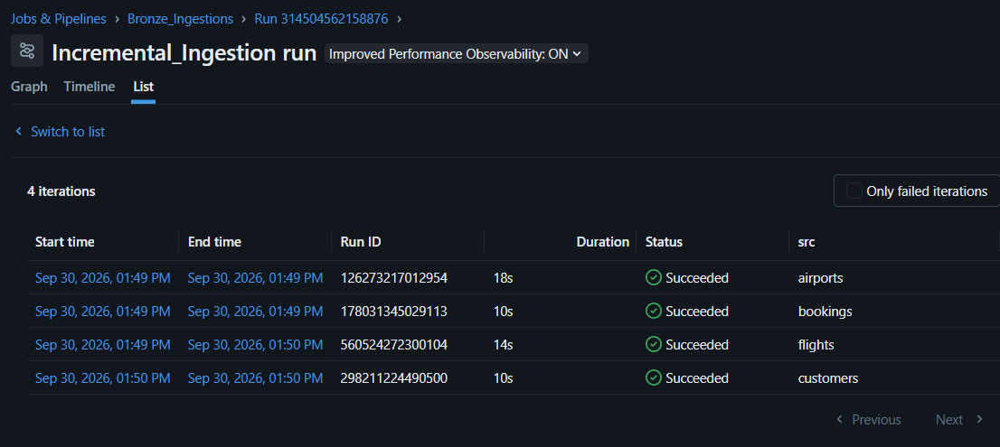
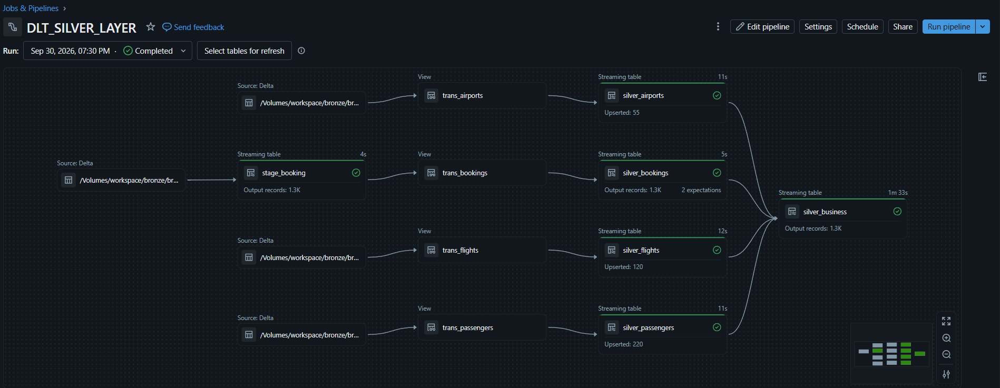
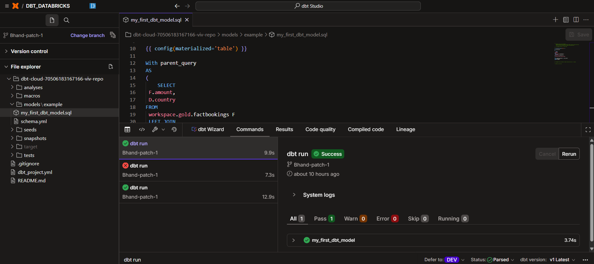

# ✈️ Databricks x dbt: End-to-End Flights Data Engineering Project


A complete data platform built on **Databricks** using the **Medallion Architecture** (Raw → Bronze → Silver → Gold), with **dbt Cloud** on top of the Gold layer for analytics.

Data about **airports, flights, customers (passengers) and bookings** arrives as CSV files from different source teams. This project ingests it incrementally, cleans and validates it, models it as a star schema, and finally builds an analytics model with dbt.

---

## 🧩 Problem Statement

A flight booking business receives data about **airports, flights, customers and bookings** as CSV files from four different source teams. The files arrive continuously, and the business faces these problems:

- **Scattered, unreliable data:** files are raw and inconsistent: numbers and dates arrive as text, some records have missing IDs, and corrected records are re-sent as duplicates.
- **Reprocessing and duplicates:** re-reading every file on each run is slow and expensive, and loading the same file twice creates duplicate rows.
- **Repeated code:** four sources with the same ingestion pattern would mean four separate pipelines to build and maintain.
- **No analytics-ready model:** analysts cannot answer simple questions, such as *"How much revenue does each country generate?"*, without writing complex joins across raw tables.
- **No governance:** every team should only access its own data, and each stage of data quality should be clearly separated.

**Objective:** build an automated, incremental and reusable data platform on Databricks that:

1. Ingests only **new files** from each source with no duplicates (Auto Loader + checkpoints),
2. **Cleans, types and validates** the data, and keeps one latest record per business key (Delta Live Tables + CDC),
3. Models it into a **star schema** that is loaded incrementally and can be safely re-run (PySpark + Delta MERGE),
4. Serves **business-ready analytics**, such as total booking amount per country (dbt Cloud).

---

## 📑 Table of Contents

1. [Problem Statement](#-problem-statement)
2. [Project Overview](#-project-overview)
3. [Architecture](#-architecture)
4. [Tech Stack](#-tech-stack)
5. [Part 1: Raw Landing & Bronze Ingestion](#-part-1-raw-landing-zone--bronze-ingestion)
6. [Part 2: Silver Layer (Delta Live Tables)](#-part-2-silver-layer-delta-live-tables)
7. [Part 3: Gold Layer (Star Schema)](#-part-3-gold-layer-dimensions--fact)
8. [Part 4: dbt Cloud on Databricks](#-part-4-dbt-cloud--databricks)
9. [End-to-End Run Order](#-end-to-end-run-order)
10. [Key Learnings](#-key-learnings)
11. [Known Limitations & Planned Improvements](#-known-limitations--planned-improvements)

---

## 🎯 Project Overview

| Item | Details |
|------|---------|
| **Domain** | Flights / airline bookings |
| **Sources** | `airports`, `flights`, `customers`, `bookings` (CSV files) |
| **Platform** | Databricks (Unity Catalog, Volumes, Delta Lake, Jobs, DLT) |
| **Layers** | Raw → Bronze → Silver → Gold |
| **Analytics** | dbt Cloud model on top of Gold |
| **Business question answered** | *How much total booking amount does each country generate?* |

**Why Medallion?** Each layer has one responsibility. If Silver logic has a bug, I can rebuild it from Bronze without asking the source team to resend data.

---

## 🏗️ Architecture

```
 SOURCE TEAMS        RAW (landing)               BRONZE (Delta)
 ------------   --------------------------   --------------------------------
 airports   --> rawdata/airports/   --Auto--> bronzevolume/airports/data
 flights    --> rawdata/flights/    --Loader-> bronzevolume/flights/data
 customers  --> rawdata/customers/  -------->  bronzevolume/customers/data
 bookings   --> rawdata/bookings/   -------->  bronzevolume/bookings/data
                                                      │
                                                      ▼
                                   SILVER (Delta Live Tables pipeline)
                      stage_booking → trans_bookings → silver_bookings
                      trans_flights ──CDC SCD1──► silver_flights
                      trans_passengers ─CDC SCD1─► silver_passengers
                      trans_airports ──CDC SCD1──► silver_airports
                      all four silver tables ──JOIN──► silver_business
                                                      │
                                                      ▼
                                   GOLD (PySpark + Delta MERGE)
                       DimPassengers   DimFlights   DimAirports
                                   └──── FactBookings ────┘
                                                      │
                                                      ▼
                                   dbt Cloud → country-wise total amount
```

---

## 🧰 Tech Stack

- **Databricks**: notebooks, jobs, SQL Warehouse, pipelines
- **Apache Spark / PySpark**: distributed processing
- **Unity Catalog + Volumes**: governance and file storage (`catalog.schema.object`)
- **Delta Lake**: ACID tables with transaction log
- **Auto Loader (`cloudFiles`) + Structured Streaming**: incremental file ingestion
- **Delta Live Tables (Lakeflow Declarative Pipelines)**: Silver layer
- **Databricks Jobs**: orchestration with task values and For Each
- **dbt Cloud (dbt-databricks adapter)**: analytics modelling

---

# 🥉 Part 1: Raw Landing Zone & Bronze Ingestion

## What this part does

1. Source teams drop CSV files into **one raw folder per source**.
2. One Databricks Job (`Bronze_Ingestion`) runs.
3. Its first task (`Parameters`) publishes the list of sources.
4. A **For Each** loop runs the `BronzeLayer` notebook once per source.
5. The notebook uses **Auto Loader** to read only new files and append them into a Delta location in Bronze.
6. A **checkpoint** remembers what was already processed, so the next run only picks up new files.

**One job, one notebook, four sources, incremental, no duplicate processing.**

## Concepts used

| Concept | Short explanation |
|---------|-------------------|
| **Unity Catalog** | Central governance layer. Namespace: `catalog.schema.object` (e.g. `workspace.raw.rawvolume`). |
| **Volume** | A governed folder for *files* (CSV, checkpoints, etc.). Path: `/Volumes/<catalog>/<schema>/<volume>/...` |
| **Delta Lake** | Parquet + transaction log (`_delta_log`) giving ACID transactions, schema enforcement and time travel. |
| **Structured Streaming** | Treats new data as an ever-growing table processed in micro-batches. |
| **Auto Loader** | A streaming source (`cloudFiles`) that discovers new files incrementally, exactly-once, and handles schema inference/evolution. |
| **Checkpoint** | Folder where a stream saves its progress so it can restart without loss or duplicates. |
| **Task values** | Lets one job task pass small JSON data to the next task. |
| **For Each task** | Loops over a list and runs a nested task once per item. |

## Step 1: Raw landing zone

```
Catalog : workspace
Schema  : raw
Volume  : rawvolume
Folders : rawdata/airports/  rawdata/flights/  rawdata/customers/  rawdata/bookings/
```

**Why:** One folder per source means each team can get access only to its own folder. Raw files are kept exactly as received (audit and replay).

## Step 2: Bronze storage

```
Schema  : bronze
Volume  : bronzevolume
Folders : airports/  flights/  customers/  bookings/
          each contains → data/        (Delta table files, used by Silver)
                          checkpoint/  (streaming progress + schema history)
```

**Why separate `data` and `checkpoint`?** `data` is business content; `checkpoint` is engine bookkeeping. Deleting a checkpoint by mistake would cause everything to be re-ingested.

## Step 3: Why one dynamic job instead of four

All four sources follow the same pattern (CSV in → Delta out). Instead of four notebooks, I wrote the logic **once**, parameterized the source name, and looped over a list. Adding a fifth source (e.g. `payments`) only needs new folders and one more entry in the list, with **no new code**.

## Step 4: The `BronzeLayer` notebook

**Cell 1: read the parameter**

```python
src_value = dbutils.widgets.get("source")
```

The job passes `source` (e.g. `"airports"`); all paths below are built from it.

**Cell 2: Auto Loader streaming read**

```python
df = (spark.readStream.format("cloudFiles")
      .option("cloudFiles.format", "csv")
      .option("cloudFiles.schemaLocation",
              f"/Volumes/workspace/bronze/bronzevolume/{src_value}/checkpoint")
      .option("cloudFiles.schemaEvolutionMode", "rescue")
      .load(f"/Volumes/workspace/raw/rawvolume/rawdata/{src_value}/"))
```

| Option | Meaning |
|--------|---------|
| `cloudFiles.format = csv` | Source files are CSV |
| `cloudFiles.schemaLocation` | Where Auto Loader stores the inferred schema (inferred once, then reused) |
| `schemaEvolutionMode = rescue` | Schema stays fixed; unexpected columns/values go to `_rescued_data` instead of failing the stream |

> For CSV, Auto Loader infers **all columns as strings** by default. That is why type casting is done later in Silver.

**Cell 3: row count before writing** (observability)

```python
print("Before Write Total Count : " + str(
    spark.read.format("delta").load(f".../{src_value}/data").count()))
```

**Cell 4: streaming write (this is where it actually runs)**

```python
(df.writeStream.format("delta")
   .outputMode("append")
   .trigger(once=True)
   .option("checkpointLocation", f".../{src_value}/checkpoint")
   .option("path", f".../{src_value}/data")
   .start())
```

| Piece | Meaning |
|-------|---------|
| `outputMode("append")` | Only add new rows; Bronze is append-only history |
| `trigger(once=True)` | Process what is new in one batch, then stop (job finishes, cluster is released) |
| `checkpointLocation` | Stores progress, the heart of incremental loading |
| `.start()` | Starts the query; nothing runs before this |

**Cell 5:** row count after writing. *After − Before = rows ingested in this run.*

## Step 5: How the checkpoint works

```
checkpoint/
├── _schemas/   ← Auto Loader's inferred schema versions
├── metadata    ← unique ID of the streaming query
├── offsets/    ← "I am about to process this batch" (written BEFORE processing)
├── commits/    ← "this batch is finished" (written AFTER processing)
└── sources/    ← Auto Loader's registry of files already processed
```

- If `offsets/5` exists **and** `commits/5` exists → batch 5 is complete; the next run starts batch 6.
- If `offsets/5` exists but **no** `commits/5` → it crashed mid-batch; batch 5 is re-run. Delta's idempotent writes prevent duplicates.
- **Golden rule:** never delete or edit a checkpoint casually, because the stream would forget everything and re-ingest all files.

**Life of one run:**
1. A team uploads `flights_2024_06.csv` to `raw/flights/`.
2. The job triggers `BronzeLayer(source="flights")`.
3. Auto Loader finds the file is new, writes `offsets/N`, reads and writes rows to `bronze/flights/data`, then writes `commits/N`.
4. On the next run the file is already in the registry, so it is skipped.

## Step 6: The `Parameters` notebook

```python
src_array = [
    {"src": "airports"},
    {"src": "bookings"},
    {"src": "flights"},
    {"src": "customers"}
]
dbutils.jobs.taskValues.set(key="output_key", value=src_array)
```

A list of dictionaries, where each dictionary is one loop iteration. It is published as a **task value** so the next task can use it.

## Step 7: Building the job `Bronze_Ingestion`

| Task | Type | Configuration |
|------|------|---------------|
| `Parameters` | Notebook | Publishes `output_key` = list of 4 sources |
| `For Each` | For Each | Input: `{{tasks.Parameters.values.output_key}}` |
| ↳ nested task | Notebook (`BronzeLayer`) | Parameter `source` = `{{input.src}}` |

```
Parameters ──► For Each ──► BronzeLayer(source="airports")
                        ──► BronzeLayer(source="bookings")
                        ──► BronzeLayer(source="flights")
                        ──► BronzeLayer(source="customers")
```

**Names that must match:**

| Where | Name | Must match |
|-------|------|------------|
| Parameters notebook | `key="output_key"` | `{{tasks.Parameters.values.output_key}}` |
| Dict key in list | `"src"` | `{{input.src}}` |
| Task parameter | `source` | `dbutils.widgets.get("source")` |

The For Each **concurrency** setting controls whether sources run one by one or in parallel.





## Step 8: Scheduling note

`trigger(once=True)` / `availableNow=True` plus a **scheduled job** (e.g. every 10 minutes) is cost-efficient: each run processes new files and exits, so the cluster can shut down between runs. `processingTime` keeps the stream alive 24/7, which is better avoided inside a For Each loop.

---

# 🥈 Part 2: Silver Layer (Delta Live Tables)

## What this part does

Reads the Bronze data, **cleans, types, validates, deduplicates/upserts** it, stores it as proper Silver tables, and builds one joined business table (`silver_business`). Everything lives in one DLT pipeline file: `transformations/dltPipeline.py`.

## Concepts used

| Concept | Short explanation |
|---------|-------------------|
| **DLT / Lakeflow Declarative Pipelines** | *Declarative* ETL: I define the datasets; DLT works out the order, checkpoints, retries and monitoring. |
| **Streaming table** | Persisted table that processes only new data each update. |
| **View** | Temporary logic step; not stored. Used for `trans_*` steps to avoid extra storage. |
| **Expectations** | Data quality rules (`expect` warns, `expect_or_drop` removes rows, `expect_or_fail` stops the update). |
| **CDC** | Capturing changes (insert/update) and applying them to a target. |
| **SCD Type 1** | Overwrite with the latest value; no history. |

## Why Silver exists

| Bronze | Silver |
|--------|--------|
| Raw, all strings, may contain nulls, duplicates, `_rescued_data` | Correctly typed, validated, deduplicated, trusted |

## Setup

Created an **ETL Pipeline** in Databricks (Jobs & Pipelines). Code lives in `transformations/dltPipeline.py`. Imports: `dlt`, `pyspark.sql.functions`, `pyspark.sql.types`.

## Bookings flow

**1. Staging table**: copies Bronze bookings into a managed table inside the pipeline.

```python
@dlt.table(name="stage_booking")
def stage_bookings():
    return (spark.readStream.format("delta")
            .load("/Volumes/workspace/bronze/bronzevolume/bookings/data/"))
```

**2. Transformation view**

```python
@dlt.view(name="trans_bookings")
def trans_booking():
    df = spark.readStream.table("stage_booking")
    return (df.withColumn("amount", col("amount").cast(DoubleType()))
              .withColumn("modifiedDate", current_timestamp())
              .withColumn("booking_date", to_date(col("booking_date")))
              .drop("_rescued_data"))
```

| Transformation | Why |
|----------------|-----|
| `amount` → Double | CSV values arrived as strings; numbers are needed for sums |
| `booking_date` → Date | Proper date type for filters and joins |
| Add `modifiedDate` | Audit timestamp, also used later for incremental loading |
| Drop `_rescued_data` | Technical Auto Loader column, not business data |

**3. Silver table with data quality rules**

```python
rules = {
    "rule1": "booking_id IS NOT NULL",
    "rule2": "passenger_id IS NOT NULL"
}

@dlt.table(name="silver_bookings")
@dlt.expect_all_or_drop(rules)
def silver_bookings():
    return spark.readStream.table("trans_bookings")
```

A booking without `booking_id` cannot be identified, and one without `passenger_id` cannot be linked to a passenger. Dropped-row counts are visible in the pipeline UI's data quality tab.

## Flights, Passengers and Airports flow

Same pattern for all three: a `trans_*` view reads Bronze, adds `modifiedDate` and drops `_rescued_data`. Then an **Auto CDC flow (SCD Type 1)** upserts into a Silver streaming table.

```python
dlt.create_streaming_table("silver_flights")

dlt.create_auto_cdc_flow(
    target = "silver_flights",
    source = "trans_flights",
    keys = ["flight_id"],
    sequence_by = col("modifiedDate"),
    stored_as_scd_type = "1"
)
```

| Entity | Key |
|--------|-----|
| `silver_flights` | `flight_id` |
| `silver_passengers` | `passenger_id` |
| `silver_airports` | `airport_id` |

| Parameter | Meaning |
|-----------|---------|
| `keys` | Identifies "the same record" |
| `sequence_by` | Decides which version is newer |
| `stored_as_scd_type = 1` | Overwrite with the latest version |

**Why SCD1:** Bronze is append-only, so a corrected flight record appears as a new row. Silver must hold **one current row per key**.

## `silver_business`: one wide table

```python
@dlt.table(name="silver_business")
def silver_business():
    return (dlt.readStream("silver_bookings")
            .join(dlt.readStream("silver_flights"), ["flight_id"])
            .join(dlt.readStream("silver_passengers"), ["passenger_id"])
            .join(dlt.readStream("silver_airports"), ["airport_id"])
            .drop("modifiedDate"))
```

Joins bookings → flights → passengers → airports so each booking carries its flight, passenger and airport details. `modifiedDate` is dropped to avoid duplicate column names.




## What DLT does for me

Builds the dependency graph from the code, runs datasets in the right order, manages checkpoints, evaluates data quality rules, and provides a lineage graph and metrics in the UI. A **full refresh** resets the targets and reprocesses everything from Bronze.

---

# 🥇 Part 3: Gold Layer (Dimensions & Fact)

## What this part does

Turns Silver into a **star schema** in the `gold` schema, loaded **incrementally and idempotently** with two reusable PySpark notebooks:

- **`GOLD_DIMS`** builds `DimFlights`, `DimAirports`, `DimPassengers` (one notebook, run three times with different parameters).
- **`GOLD_FACT`** builds `FactBookings` by looking up dimension surrogate keys.

```
 DimPassengers (DimPassengersKey) ┐
 DimFlights    (DimFlightsKey)    ├──► FactBookings
 DimAirports   (DimAirportsKey)   ┘     (3 keys + booking_date + amount + modifiedDate)
```

## Concepts used

| Concept | Short explanation |
|---------|-------------------|
| **Fact table** | Measurable events (a booking) with numeric measures (`amount`) and foreign keys. |
| **Dimension table** | Descriptive context: who, what, where. |
| **Star schema** | Fact in the middle, dimensions around it. Simple and fast for BI. |
| **Surrogate key** | A generated integer key, independent of source IDs (`DimFlightsKey`). |
| **High-water mark** | The latest `modifiedDate` already loaded; only newer rows are read next time. |
| **MERGE (upsert)** | Update if the row exists, insert if not. Safe to re-run. |

## `GOLD_DIMS` notebook

**Parameters** (only this cell changes per dimension):

```python
catalog = "workspace"
key_cols = "['flight_id']"
cdc_col = "modifiedDate"
backdated_refresh = ""
source_schema, source_object = "silver", "silver_flights"
target_schema, target_object = "gold", "DimFlights"
surrogate_key = "DimFlightsKey"
```

| Dimension | Key | Source | Target | Surrogate key |
|-----------|-----|--------|--------|---------------|
| Flights | `flight_id` | `silver_flights` | `DimFlights` | `DimFlightsKey` |
| Airports | `airport_id` | `silver_airports` | `DimAirports` | `DimAirportsKey` |
| Passengers | `passenger_id` | `silver_passengers` | `DimPassengers` | `DimPassengersKey` |

**Step-by-step logic:**

1. **Find the last load date**
   - Target exists → `max(modifiedDate)` from the Gold table.
   - First run → `1900-01-01` (loads everything).
   - `backdated_refresh` set → reload from that date.
2. **Read only new/changed Silver rows**: `WHERE modifiedDate > last_load`.
3. **Get the existing target keys**: from the real table, or an empty DataFrame with the same schema (`WHERE 1=0`) on the first run, so the same code works either way.
4. **Build the join condition dynamically** from the key list (supports composite keys).
5. **LEFT JOIN source → target** on business keys:
   - Surrogate key **not null** → existing record (**old**)
   - Surrogate key **null** → brand-new record (**new**)
6. **Enrich old records**: refresh `update_date` only.
7. **Enrich new records**: generate a surrogate key and set `create_date` and `update_date`.

   ```python
   lit(max_surrogate_key) + lit(1) + monotonically_increasing_id()
   ```
8. **Union** old + new (`unionByName`).
9. **MERGE** into the Gold dimension on the surrogate key.

   ```python
   dlt_obj.alias("trg").merge(df_union.alias("src"),
                              f"trg.{surrogate_key} = src.{surrogate_key}") \
          .whenMatchedUpdateAll(condition=f"src.{cdc_col} >= trg.{cdc_col}") \
          .whenNotMatchedInsertAll() \
          .execute()
   ```
   On the very first run the table is created with an append write instead.

The `src.modifiedDate >= trg.modifiedDate` condition prevents an older version from overwriting a newer one.

```
silver table ──(modifiedDate > last_load)──► new/changed rows
                         │ LEFT JOIN existing dimension
          ┌──────────────┴──────────────┐
   key found (OLD)               key missing (NEW)
   update_date = now             new surrogate key + create/update date
          └──────────────┬──────────────┘
                     UNION ► MERGE into gold dimension
```

## `GOLD_FACT` notebook

**Parameters:**

```python
source_object = "silver_bookings"
target_object = "FactBookings"
fact_key_cols = ["DimPassengersKey", "DimFlightsKey", "DimAirportsKey", "booking_date"]
fact_columns  = ["amount", "booking_date", "modifiedDate"]
```

**Dimension config** drives the joins (one dictionary per dimension):

```python
dimensions = [
  {"table": "workspace.gold.DimPassengers", "alias": "DimPassengers", "join_keys": [("passenger_id","passenger_id")]},
  {"table": "workspace.gold.DimFlights",    "alias": "DimFlights",    "join_keys": [("flight_id","flight_id")]},
  {"table": "workspace.gold.DimAirports",   "alias": "DimAirports",   "join_keys": [("airport_id","airport_id")]},
]
```

**Dynamic SQL generator** builds this query from the config:

```sql
SELECT f.amount, f.booking_date, f.modifiedDate,
       DimPassengers.DimPassengersKey,
       DimFlights.DimFlightsKey,
       DimAirports.DimAirportsKey
FROM workspace.silver.silver_bookings f
LEFT JOIN workspace.gold.DimPassengers DimPassengers ON f.passenger_id = DimPassengers.passenger_id
LEFT JOIN workspace.gold.DimFlights    DimFlights    ON f.flight_id    = DimFlights.flight_id
LEFT JOIN workspace.gold.DimAirports   DimAirports   ON f.airport_id   = DimAirports.airport_id
WHERE f.modifiedDate >= DATE('<last_load>')
```

This is the **dimension key lookup**: the fact stores surrogate keys instead of business IDs. `LEFT JOIN` ensures no fact row is lost. `>=` with `DATE()` re-reads the last day as a safe overlap; MERGE makes that harmless.

Then the merge condition is generated from `fact_key_cols` and the result is **MERGEd into `FactBookings`** (update if newer, insert if new; first run creates the table).

**Final fact table:**

| Column | Role |
|--------|------|
| `DimPassengersKey`, `DimFlightsKey`, `DimAirportsKey` | Foreign keys |
| `booking_date` | When |
| `amount` | Measure |
| `modifiedDate` | Incremental tracking |

**Run order:** `GOLD_DIMS` (×3) → `GOLD_FACT`, because the fact needs the dimension keys to exist.

---

# 📊 Part 4: dbt Cloud + Databricks

## What this part does

Connects **dbt Cloud** to the Databricks SQL Warehouse and builds an analytics model on Gold: **total booking amount per country**.

## Concepts used

| Concept | Short explanation |
|---------|-------------------|
| **dbt** | The "T" in ELT. You write a `SELECT`; dbt creates the table/view. All compute happens in Databricks. |
| **Model** | A `.sql` file with one `SELECT`; becomes one table or view. |
| **Materialization** | How a model is stored: `view`, `table`, `incremental`, `ephemeral`. |
| **Jinja** | Templating (`{{ }}`) evaluated before the SQL runs. |
| **Managed repository** | Git repo hosted by dbt Cloud. |

## Steps I followed

1. **Created a dbt Cloud account**: a hosted environment with IDE, Git and job scheduling, so no local install is needed.
2. **Created the project `DBT_DATABRICKS`**: the container for the connection, repository and models.
3. **Connected Databricks** using two values from the SQL Warehouse's *Connection details*:
   - **Host name**: which workspace
   - **HTTP path**: which SQL warehouse
4. **Generated a Personal Access Token** in Databricks (User Settings → Developer → Access tokens) and added it in dbt Cloud's credentials. It is treated like a password: never committed to Git.
5. **Tested the connection**: success means the host, HTTP path and token are all valid.
6. **Created a managed repository `viv-repo`** for version control.
7. **Wrote the model** `models/example/my_first_dbt_model.sql`:

```sql
{{ config(materialized='table') }}

WITH parent_query AS (
    SELECT F.amount, D.country
    FROM workspace.gold.factbookings F
    LEFT JOIN workspace.gold.dimairports D
      ON F.DimAirportsKey = D.DimAirportsKey
)
SELECT country, SUM(amount) AS total_amount
FROM parent_query
GROUP BY country
```

   - `config(materialized='table')` creates a physical table.
   - The CTE joins fact → dimension on the surrogate key to get `country`.
   - `GROUP BY country` with `SUM(amount)` answers the business question.
8. **Committed** the code to `viv-repo`.
9. **Ran `dbt run`**. Behind the scenes dbt:
   1. Parses the project and builds the dependency graph.
   2. Compiles Jinja into plain SQL.
   3. Wraps the query in `CREATE OR REPLACE TABLE ... USING DELTA AS (...)`.
   4. Sends it to the SQL Warehouse using host + HTTP path + token.
   5. Databricks executes it and stores the result as a Delta table.

## Result

dbt created a **new schema** (from the development credentials) in the `workspace` catalog and a new Delta table `my_first_dbt_model` with columns `country` and `total_amount` (one row per country).

```sql
SELECT * FROM workspace.<dbt_schema>.my_first_dbt_model;
```

---



## 🔁 End-to-End Run Order

1. Drop CSV files into `raw/<source>/`
2. Run job **`Bronze_Ingestion`** (Parameters → For Each → BronzeLayer)
3. Run the **DLT pipeline** (Silver tables)
4. Run **`GOLD_DIMS`** three times (Flights, Airports, Passengers)
5. Run **`GOLD_FACT`**
6. Run **`dbt run`** in dbt Cloud

---

## 💡 Key Learnings

- Designing **reusable, parameter-driven pipelines** (one notebook/job for many sources).
- **Incremental and idempotent** loading using checkpoints, high-water marks and MERGE.
- Applying **data quality rules** and **CDC / SCD Type 1** patterns.
- Modelling a **star schema** with surrogate keys, audit columns and a dynamic fact load.
- Connecting **dbt Cloud** to Databricks and building a model on Gold.

---
